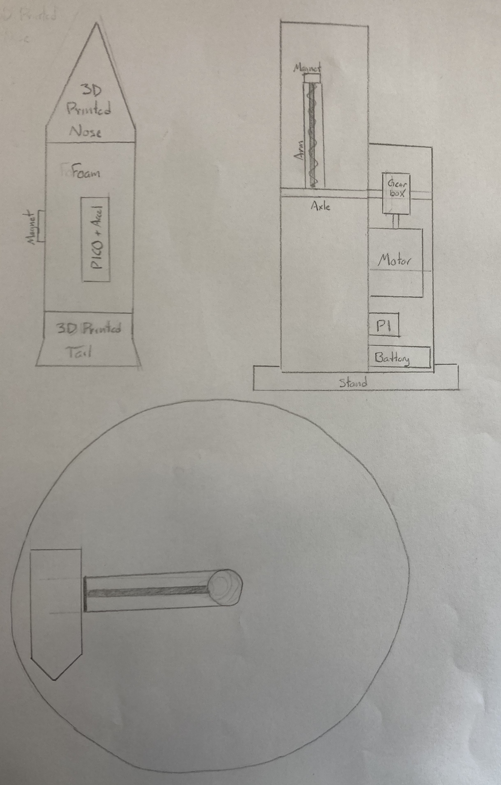

# VORTEx (Velocity Optimized Rotational Thrust Experiment)
## Conklin-Damiani-PITS Planning Document, Engineering 4 2023/24
### Design Goal
This design is inspired by the American startup, SpinLaunch. The company utilizes kinetic energy as opposed to traditional chemical jet prupolsion to launch their rockets, saving on launch time and fuel cost. One of the biggest bottlenecks in jet prupolsion is the infamous "rocket equation," an equation that will be discussed in depth later in this section. In simplest terms, this equation details that the more fuel you have on board, the returns of distance and prupolsion are diminished due to the higher mass of fuel. Kinetic launches bypass this, imagine a trebuchet instead launching a glider instead of a model airplane that has to have a battery, circuitboard, and other (fuel equivalent) componets. With the trebuchet, all of the potential energy is stored at the launch site in the counterweight, meaning that no potential energy needs to be stored within the payload itself. However, rudamentary kinetic systems like trebuchets and spring launches can only (literally) take you so far. However, a lot can be learned from how these systems function. If you track the trajectory of a payload within a trebuchet launch system, it follows an orbital path around the center of rotation. This orbita path is very useful in the context of high velocity launches, as an object released from orbit follows a path tangent to its position on the path, meaning the launch angle and thus trajectory can be tuned to an exact margin. However, a trebuchet (or similar concepts) are constrained by the way in which they store potential energy, namely the amount of counterweight that can be contained in a system. SpinLaunch, on the other hand, uses an extremely powerful motor to spin a beam to over 6 times the speed of sound, releasing the payload in the form of a rocket from ane exact point on the path.
&nbsp;
### Scope
This project will attempt to recreate a 1:108 scale model of SpinLaunch's orbital launch system so as to launch a payload to gather data while in flight. The payload will return to the ground using a parachute so that the data can be analyzed. Using a scale such as this allows us to sidestep many of the design difficulties when operating on such a scale (Spinlaunch's test module is roughly 33 meters in diameter, nearly half the wingspan of a 747). Some of these challenges still exist, even at this scale, and a modular approach to design will ensure that our project can move along at a consistent rate. The first iteration will be a low RPM prototype lying on its side with no exterior walls. This guarantees that our first few launches will be safe and give us valuable inofrmation as to how to proceed. The next iteration will also be low RPM but on a vertical orientation and with exterior walls. This iteration will allow us to test and optimize the escape angle and time, and determine what precision our release mechanism is capable of. Finally, we will move to launching at a high RPM with a small escape window, gathering data and improving our payload design itself to finalize our design. This project is ambitious, and will require meticulous planning, design, and documentation, but is not overly difficult. If done correctly, it will demonstrate physical, mechanical, and electrical concepts in a clear and accesible way.
&nbsp;
### Schedule
Week 1 (January 2-5)------------: Continue designs, drawings, initial CAD design of launcher. 

Week 2 (January 8-12)-----------: Design and CAD payload, block out code for launcher. 

Week 3 (January 15-19)----------: Finish CAD for launcher, code launcher. 

Week 4 (January 22-26)----------: Start assembly for prototype launcher, prototype payload, finish coding launcher.

Week 5 (January 29-February 2)--: Start assembly for prototype launcher, prototype payload, finish coding launcher.

Week 6 (February 5-9)-----------: Finish assembly for Mk. 1 launcher and Mk. 1 rocket, code payload (data collection).

Week 7 (February 12-16)---------: Design parachute, test parachute release mechanism

Week 8 (February 19-23)---------: Dry run launcher (without payload), test release mechanism at medium speeds

Week 9 (February 26-March 1)----: Launch prototype with payload, low RPM, lateral

Week 10 (March 4-8)-------------: Improve design for launcher and payload, strengthen weak points. Add walls and exit point if possible.

Week 11 (March 11-15)-----------: Launch prototype II with payload, medium RPM, vertical.

Week 12 (March 18-22)-----------: If walls and exit point not added already, add. Perform kinetics tests for the pico, improve cushioning and structure.

Week 13 (March 25-29)-----------: Launch prototype II with high RPM, vertical.

Week 15 (April 8-12)------------: Improve payload mechanism, ensure pico is secured.

Week 16 (April 15-19)-----------: Final changes, add decals.

Week 17 (April 22-26)-----------: Launches and data collection.

Week 18 (April 29-May 3)--------: Data Analysis, recording and organizing.

Week 19 (May 6-10)--------------: Finish documentation.

Week 20 (May 13-17)-------------: Finish documentation. 
&nbsp;

### Sketches

&nbsp;
### Pseudocode
**Launcher Code:**  
Set up motor  
Set target motor speed  
Set target for encoder value  
Define variables  
Increase motor up to target speed  
Spin motor until target encoder value reached  
Turn off electromagnet  
Stop motor  
**Rocket Code:**  
Set up accelerometer  
Define variables  
Collect position data  
Save data  
Deploy parachute
&nbsp;
### Bill of materials
**Launcher**  
-REV Robotics Core Hex Motor  
-REV Robotics 90° Gearbox  
-REV Stackable Ultraplanetry Gearboxes  
-Compatable Hex Shaft  
-PiCO Board  
-Battery (type not decided yet)  
      -Potentially DC Power Supply  
-Enforced Low Carbon Steel Rod  
-Acrylic for base and reinforcement  
-Aluminum for parts with high stress  
-PLA for low stress components  
**Payload**  
-Foam Core for Body  
-PLA for Tail and Nose for Shock Absorbance  
-PiCO Board  
-Accelerometer  
-Gyroscope (possibly)  
-Connection for electromagnet (see diagram)  
-Acrylic skeleton for structural stability  
-Servo for parachute release
-Trashbag for parachute
-Paracord
&nbsp;
### Risk Mitigation
This project requires careful planning to ensure that proper precautions are taken when operating. PPE will be required to be within firing radius (or 20 feet) of the launcher. When the launcher is active (spinning and or armed), additional precautions must be taken. A "remote" arming and activation procedure will be utilized, essentially a long wire with a controller to arm and launch that can be used from outside a 10 foot radius. Furthermore, all launch areas must be scouted beforehand to ensure their safety, and proper precautions must be taken to ensure that the parachute will deploy, such as low rpm and rotational speed tests. Built in to the project planning is an incremental increase in RPM so as to ensure each step is safe before progressing to the max RPM range.

